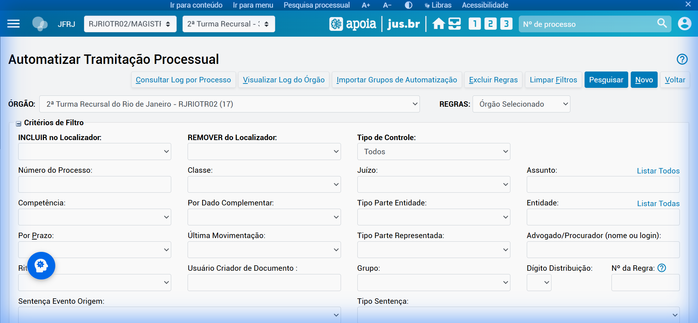
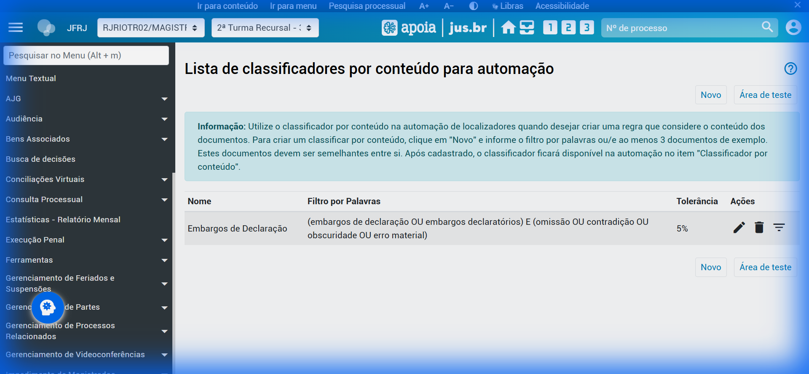
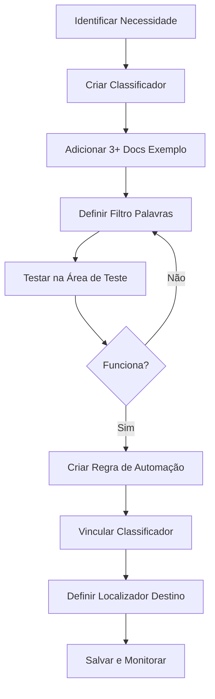

# Guia Prático de Automação - Eproc 2ª Turma Recursal

## Resumo Executivo

Este guia consolida as diretrizes dos manuais do eproc para criação de regras de automação de tramitação processual.

---

## Estado Atual do Sistema (Dez/2025)

| Recurso | Quantidade |
|---------|------------|
| **Regras de Automação** | 17 regras cadastradas |
| **Classificadores por Conteúdo** | 1 ativo |
| **Localizadores Disponíveis** | 513 |

### Classificador Ativo: Embargos de Declaração

```
Filtro: (embargos de declaração OU embargos declaratórios) E (omissão OU contradição OU obscuridade OU erro material)
Tolerância: 5%
```

---

## URLs de Acesso Rápido

| Recurso | Ação no eproc |
|---------|---------------|
| Lista de Automações | `acao=automatizar_localizadores` |
| Editar Regra | `acao=automatizar_localizadores_alterar&id_controle_localizador_sistema=XXX` |
| Classificadores por Conteúdo | `acao=inteligencia_artificial/classificador_conteudo/listar` |

---

## Conceitos Fundamentais

### 1. Localizadores
Etiquetas que identificam a situação ou estágio do processo. A 2ª TR possui **513 localizadores** organizados por:
- **Gabinete** (2.1, 2.2, 2.3)
- **Tipo de benefício** (Aposentadoria, LOAS, Pensão, etc.)
- **Temas de suspensão** (STF, STJ, TNU)
- **Fluxo de trabalho** (Mesas, Minutas, Prazos)

### 2. Classificadores por Conteúdo
Recurso de IA que analisa o conteúdo dos documentos anexados:
- Compara com **documentos de exemplo** (mínimo 3)
- Usa **filtros por palavras-chave**
- Define **tolerância de similaridade** (recomendado: ≤5%)

> **Limitação**: Não funciona com PDFs digitalizados (imagens). Apenas PDFs com texto.

---

## Sintaxe de Filtros por Palavras

| Operador | Função | Exemplo |
|----------|--------|---------|
| `"..."` ou `'...'` | Frase exata | `"aposentadoria especial"` |
| `OU` | Uma ou mais palavras válidas | `aposentadoria OU pensão` |
| `E` | Palavras obrigatórias | `incapacidade E permanente` |
| `!` ou `NÃO` | Excluir palavra | `aposentadoria !rural` |
| `()` | Agrupar condições | `(rural OU urbana) E idade` |

> O sistema diferencia acentuação, mas ignora maiúsculas/minúsculas.

---

## Interface do Sistema

### Tela de Automação de Localizadores


### Tela de Classificadores por Conteúdo


---

## Templates de Regras de Automação

### Template 1: Triagem por Tipo de Benefício

**Objetivo**: Distribuir processos novos para localizadores por tipo de benefício.

| Campo | Valor |
|-------|-------|
| **Regra** | Triagem Ap. Especial |
| **Localizador Origem** | `PETIÇÃO INICIAL TR` |
| **Localizador Destino** | `2.3 Ap. Especial/ATC` |
| **Classificador** | Criar com palavras: `"aposentadoria especial" OU "tempo especial" OU "atividade insalubre"` |

---

### Template 2: Suspensão por Tema STF/STJ

**Objetivo**: Mover processos automaticamente para localizadores de suspensão.

| Campo | Valor |
|-------|-------|
| **Regra** | Tema 1.102/STF - Revisão Vida Toda |
| **Critério** | Assunto do processo contém: `Revisão` |
| **Classificador** | Palavras: `"revisão da vida toda" OU "regra definitiva" OU "art. 29"` |
| **Localizador Destino** | `2.3 tema 1.102/STF - Suspensos` |

---

### Template 3: Decurso de Prazo

**Objetivo**: Mover processos após decurso de prazo para gabinete.

| Campo | Valor |
|-------|-------|
| **Regra** | Decurso Prazo Contrarrazões |
| **Evento Gatilho** | Prazo fechado |
| **Tipo Prazo** | Pólo Passivo |
| **Localizador Destino** | `2.3 Aguardando recebimento` |

---

## Fluxo de Criação de Regra



---

## Próximos Passos

1. **Definir prioridades** - Quais automações são mais urgentes?
2. **Coletar documentos exemplo** - Para cada classificador, identificar 3+ processos modelo
3. **Testar classificadores** - Usar área de teste antes de ativar
4. **Implementar gradualmente** - Começar com regras de menor impacto

---

## Referências

- [LocalizadoresOrgao-2025-12-17.csv](Manuais/LocalizadoresOrgao-2025-12-17-17-46-6.csv) - Lista completa de localizadores
- Manual de Classificadores por Conteúdo (`Manuais/txt/`)
- Manual de Automatização de Localizadores (`Manuais/`)
