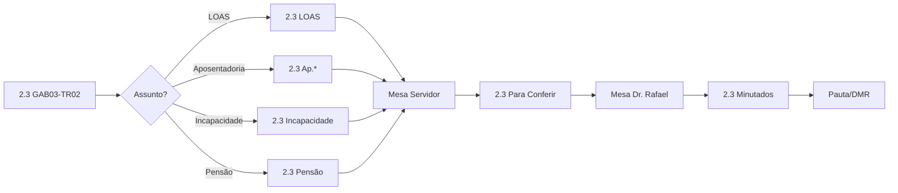

# Plano Consolidado de Automação - Gabinete 2.3

**Versão:** 2.0  
**Data:** 28/12/2025  
**Status:** 🔄 Em Refinamento (próxima etapa: Claude Code)

---

## 1. Decisões de Arquitetura

| Aspecto | Decisão |
|---------|---------|
| **Entrada** | Todos os processos iniciais passam por `2.3 GAB03-TR02` |
| **Triagem** | Baseada no **Assunto** (cadastro do processo) |
| **Mesas** | Cada servidor tem sua mesa individual |
| **Suspensão** | Apenas **adiciona tag** (não remove do localizador atual) |
| **Alertas** | Apenas **adiciona tag** (não remove do localizador atual) |

---

## 2. Ciclo de Vida do Processo

```
ENTRADA → TRIAGEM → TRABALHO → CONFERÊNCIA → JULGAMENTO → SAÍDA
```

### Fluxo Principal



---

## 3. Hierarquia de Localizadores

Um processo pode estar em **múltiplos localizadores** simultaneamente:

| Camada | Tipo | Comportamento | Exemplo |
|--------|------|---------------|---------|
| **Principal** | Etapa do fluxo | Exclusivo (move) | `Mesa João`, `Para Conferir` |
| **Matéria** | Tipo de benefício | Adiciona | `2.3 LOAS`, `2.3 Ap. Rural` |
| **Suspensão** | Tema repetitivo | Adiciona | `2.3 Tema 1.102/STF` |
| **Alerta** | Controle de prazo | Adiciona | `2.3 Parados >60 dias` |
| **Mês** | Controle temporal | Adiciona | `2.3 Dezembro 2025` |

---

## 4. Mapeamento Assunto → Localizador

| Assunto (eproc) | Localizador Destino |
|-----------------|---------------------|
| Benefício Assistencial (Art. 203,V CF/88) | `2.3 LOAS` |
| Deficiente, Benefício Assistencial | `2.3 LOAS` |
| Idoso, Benefício Assistencial | `2.3 LOAS` |
| Aposentadoria Especial (Art. 57/8) | `2.3 Ap. Especial/ATC` |
| Aposentadoria por Tempo de Contribuição | `2.3 Ap. Especial/ATC` |
| Aposentadoria por Idade - Urbana | `2.3 Ap. Idade urbana` |
| Aposentadoria por Idade - Rural | `2.3 Ap. Rural` |
| Aposentadoria por Idade - Híbrida | `2.3 Ap. Idade urbana` |
| Auxílio-Doença Previdenciário | `2.3 Benefício Incapacidade` |
| Aposentadoria por Invalidez | `2.3 Benefício Incapacidade` |
| Pensão por Morte | `2.3 Pensão (RGPS)` |
| Revisão da Vida Toda | `2.3 Revisão` |
| Salário-Maternidade | `2.3 Outros previdenciário` |
| Auxílio-Reclusão | `2.3 - Auxílio-Reclusão` |

---

## 5. Regras de Automação

### Grupo 1: Triagem por Assunto (TRIA-*)

| ID | Assunto | Destino | Comportamento |
|----|---------|---------|---------------|
| TRIA-01 | Benefício Assistencial* | `2.3 LOAS` | Move |
| TRIA-02 | Aposentadoria Especial + ATC | `2.3 Ap. Especial/ATC` | Move |
| TRIA-03 | Aposentadoria por Idade | `2.3 Ap. Idade urbana` | Move |
| TRIA-04 | Auxílio-Doença + Invalidez | `2.3 Benefício Incapacidade` | Move |
| TRIA-05 | Pensão por Morte | `2.3 Pensão (RGPS)` | Move |
| TRIA-06 | Aposentadoria Rural | `2.3 Ap. Rural` | Move |

### Grupo 2: Suspensão por Tema (SUSP-*)

| ID | Tema | Destino | Comportamento |
|----|------|---------|---------------|
| SUSP-01 | 1.102/STF (Vida Toda) | `2.3 tema 1.102/STF` | **Apenas adiciona** |
| SUSP-02 | 1.031/STJ (Vigilante) | `2.3 Tema 1031/STJ` | **Apenas adiciona** |
| SUSP-03 | 1.124/STJ (Termo Inicial) | `2.3 tema 1124/STJ` | **Apenas adiciona** |
| SUSP-04 | 1.437/STF (Auxílio-alimentação) | `2.3 Tema 1437/STF` | **Apenas adiciona** |

### Grupo 3: Controle de Prazos (PRAZO-*)

| ID | Condição | Destino | Comportamento |
|----|----------|---------|---------------|
| PRAZO-01 | Parado >60 dias | `2.3 ALERTA >60 dias` | **Apenas adiciona** |
| PRAZO-02 | Parado >120 dias | `2.3 CRÍTICO >120 dias` | **Apenas adiciona** |
| PRAZO-03 | Parte idosa + parado >30 dias | `2.3 PRIORIDADE IDOSO` | **Apenas adiciona** |
| PRAZO-04 | Decurso contrarrazões | `2.3 Recurso recebido` | Move |

### Grupo 4: Fluxo de Trabalho (FLUXO-*)

| ID | Gatilho | Destino | Ação Adicional |
|----|---------|---------|----------------|
| FLUXO-01 | Petição: Embargos de Declaração | `2.3 Embargos de Declaração` | Lançar minuta |
| FLUXO-02 | Petição: Agravo Interno | `2.3 Agravo contra DMT` | - |
| FLUXO-03 | Evento: Minuta conferida | `Mesa Dr. Rafael` | - |

---

## 6. Localizadores a Criar

| Localizador | Propósito |
|-------------|-----------|
| `2.3 ALERTA - Parados >60 dias` | Controle de processos parados |
| `2.3 CRÍTICO - Parados >120 dias` | Alerta crítico |
| `2.3 PRIORIDADE IDOSO` | Prioridade para idosos |

---

## 7. Ordem de Implementação

```
1º → SUSP-* (Suspensão)    ← Primeiro, para não distribuir processos suspensos
2º → TRIA-* (Triagem)      ← Depois, distribuir por matéria
3º → FLUXO-* (Fluxo)       ← Movimentações por evento
4º → PRAZO-* (Prazos)      ← Por último, alertas automáticos
```

---

## 8. Próximos Passos (Claude Code)

- [ ] Explorar acervo atual no eproc
- [ ] Validar mapeamento Assunto → Localizador
- [ ] Identificar assuntos não mapeados
- [ ] Verificar localizadores existentes vs. propostos
- [ ] Refinar regras com base nos dados reais
- [ ] Criar classificadores por conteúdo (se necessário como fallback)

---

## Referências

- [ASSUNTOS_PREVIDENCIARIO_ASSISTENCIAL.md](Manuais/ASSUNTOS_PREVIDENCIARIO_ASSISTENCIAL.md)
- [LocalizadoresOrgao-2025-12-17.csv](Manuais/LocalizadoresOrgao-2025-12-17-17-46-6.csv)
- [REGRAS_VERSAO_FINAL.md](REGRAS_VERSAO_FINAL.md)
- [ANALISE_GESTAO_GAB3.md](ANALISE_GESTAO_GAB3.md)
