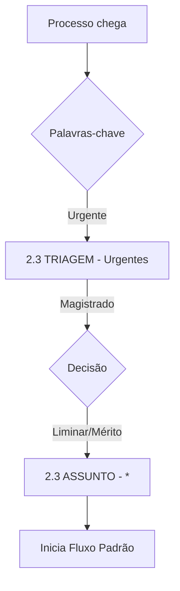

# Fluxos de Processo (Mermaid Diagrams)

## 1. Fluxo Padrão (Processo Comum)

```mermaid
graph TD
    A[Processo chega] --> B{Automação}
    B --> C[2.3 TRIAGEM - Geral]
    C -->|Classificação| D{Assunto?}
    
    D -->|Aposentadoria| E1[2.3 ASSUNTO - Aposentadoria]
    D -->|LOAS| E2[2.3 ASSUNTO - LOAS/BPC]
    
    E1 --> F{Tempo decorrido}
    
    F -->|0-90 dias| G1[+ 2.3 PRAZO - Regular]
    F -->|91-110| G2[+ 2.3 PRAZO - Atenção]
    F -->|111-119| G3[+ 2.3 PRAZO - Urgente]
    
    G3 --> H{Distribuir?}
    
    H -->|Sim| I[+ 2.3 MESA - Assessor]
    I -->|MANTÉM Assunto| J[2.3 ASSUNTO + <br/>2.3 MESA - Assessor]
    
    J -->|Minutado| K[+ 2.3 GABINETE - Minutados<br/>(Remove Mesa)]
    K -->|Aprovado| L[+ 2.3 GABINETE - Pronto Pauta]
    
    L --> N[+ 2.3 PAUTA - Sessão [Data]]
    N -->|Julgado| O[2.3 PAUTA - Julgados]
    O --> P[SAI DO GABINETE]

## 2. Fluxo de Incidentes e Retornos

```mermaid
graph TD
    A[Protocolo/Retorno] --> B{Tipo?}
    
    B -->|Agravo| C[2.3 TRIAGEM - Agravo Interno]
    B -->|Retorno TNU| D[2.3 TRIAGEM - Retratação/Volta]
    
    C --> E{Origem?}
    E -->|Monocrática| F[Mesa Relator]
    E -->|Admissibilidade| F
    
    D --> G[Mesa Relator]
    G --> H[Juízo de Retratação?]
    
    H -->|Mantém Decisão| I[Voto Confirmando]
    H -->|Retrata-se| J[Novo Voto]
```
```

## 2. Fluxo Urgente


