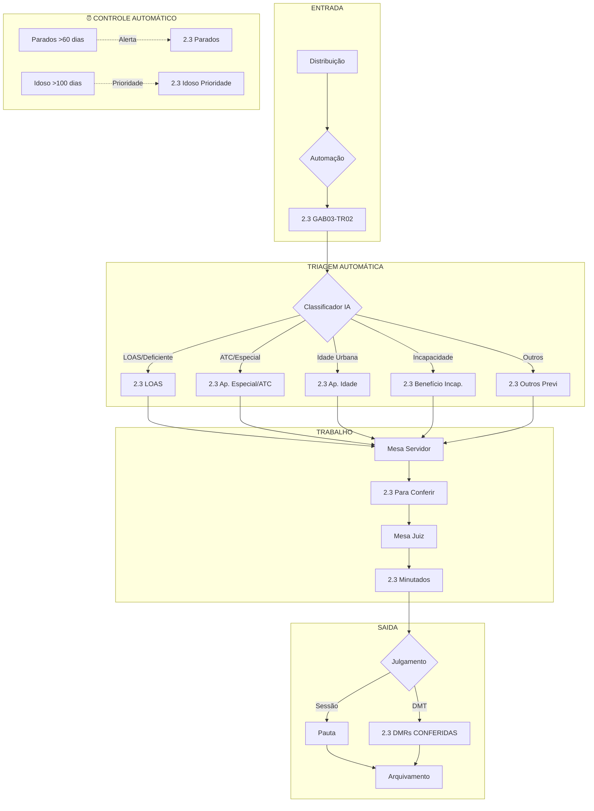

# Análise de Gestão Processual - Gabinete 2.3 (3º Juiz Relator)

**Unidade:** RJRIOTR02G03 - 2ª Turma Recursal  
**Analista:** Especialista em Gestão Processual  
**Data:** 19/12/2025

---

## Sumário Executivo

### Diagnóstico Rápido

| Indicador | Valor | Avaliação |
|-----------|-------|-----------|
| Acervo Total | 1.561 | ⚠️ Moderado |
| Processos Ativos | 1.345 (86%) | ✅ Bom |
| Meta 1 (Produtividade) | 131% | ✅ Excelente |
| Meta 2 (Acervo Antigo) | 100% | ✅ Excelente |
| Parados >120 dias | 0 | ✅ Excelente |
| Parados 31-60 dias | 317 | ⚠️ Atenção |

### Principais Gargalos Identificados

1. **Aguardando Recebimento**: 540 processos (35% do acervo)
2. **Petições Iniciais**: 467 processos sem triagem
3. **Para Conferir**: 265 minutas aguardando revisão
4. **Tema 1031/STJ (Vigilantes)**: 130 processos suspensos

---

## Análise dos Localizadores Atuais

### Distribuição por Categoria

```
┌─────────────────────────────────────────────────────────────┐
│                    ACERVO TOTAL: 1.561                       │
├─────────────────────────────────────────────────────────────┤
│ ENTRADA (467)          │ TRABALHO (800+)    │ SAÍDA (294)   │
│ ┌─────────────────┐   │ ┌───────────────┐  │ ┌───────────┐ │
│ │ Petição Inicial │   │ │ Ag. Recebim.  │  │ │ Minutados │ │
│ │     467         │   │ │     540       │  │ │    253    │ │
│ └────────┬────────┘   │ ├───────────────┤  │ └───────────┘ │
│          │            │ │ Para Conferir │  │               │
│          ▼            │ │     265       │  │               │
│ ┌─────────────────┐   │ ├───────────────┤  │               │
│ │ Triagem Manual  │   │ │ Por Assunto   │  │               │
│ └─────────────────┘   │ │   (vários)    │  │               │
│                       │ └───────────────┘  │               │
└─────────────────────────────────────────────────────────────┘
```

### Localizadores com Maior Acervo (Top 10)

| # | Localizador | Qtd | % | Situação |
|---|-------------|-----|---|----------|
| 1 | 2.3 Aguardando recebimento | 540 | 34,6% | ⚠️ Gargalo |
| 2 | 2.3 GAB03-TR02 (Pet. Inicial) | 467 | 29,9% | ⚠️ Gargalo |
| 3 | 2.3 - para conferir | 265 | 17,0% | ⚠️ Gargalo |
| 4 | 2.3 Minutados | 253 | 16,2% | ✅ Normal |
| 5 | 2.3 SUSPENSOS | 174 | 11,1% | ✅ Justificado |
| 6 | 2.3 - Tema 1031/STJ | 130 | 8,3% | ✅ Suspenso CNJ |
| 7 | 2.3 Recurso recebido | 125 | 8,0% | ⚠️ Fluxo |
| 8 | 2.3 Benefício Incapacidade | 104 | 6,7% | ✅ Triagem |
| 9 | 2.3 LOAS | 104 | 6,7% | ✅ Triagem |
| 10 | 2.3 Idoso >150 dias | 92 | 5,9% | 🔴 Crítico |

---

## Problemas Identificados

### 🔴 Problema 1: Triagem Manual Ineficiente

**Situação Atual:**
- 467 processos na "Petição Inicial" aguardando triagem manual
- Não há automação ativa para distribuir por tipo de benefício

**Impacto:**
- Atraso no início do trabalho efetivo
- Servidores gastam tempo classificando manualmente

---

### 🔴 Problema 2: Localizadores Duplicados/Redundantes

**Localizadores de "Parados" identificados:**
- `2.3 Parados > 150 dias` (1 processo)
- `2.3 GAB3TR02 - Parados + 150 dias` (11 processos)
- `2.3 GAB3TR02 - Parados + 120 e - 150 DIAS` (3 processos)
- `2.3 GAB3TR02 - Parados + 90 e - 120 DIAS` (15 processos)
- `2.3 Idoso paralisado há mais de 150 dias` (92 processos)

**Problema:** 5 localizadores para controlar a mesma situação!

---

### 🔴 Problema 3: Localizadores por Mês Acumulados

Existem localizadores de meses antigos com processos:
- `2.3 - novembro 2023` (3)
- `2.3 - novembro 2024` (3)
- `2.3 Fevereiro 2024` (3)
- `2.3 abril 2024` (3)
- ...e muitos outros

**Problema:** Localizadores temporários nunca são limpos

---

### 🔴 Problema 4: Regras de Automação Inativas

Das 17 regras mapeadas, **16 estão INATIVAS**, incluindo:
- Distribuição automática por gabinete
- Triagem por tema (1.102/STF)
- Triagem por tipo de benefício

---

## Fluxo Proposto

### Fluxo Otimizado de Tramitação



---

## Propostas de Melhoria

### Proposta 1: Ativar Automação de Triagem

**Ação:** Ativar regras de triagem por tipo de benefício

| Origem | Classificador | Destino |
|--------|---------------|---------|
| 2.3 GAB03-TR02 | "BPC" OU "LOAS" OU "deficiente" | 2.3 LOAS |
| 2.3 GAB03-TR02 | "especial" OU "insalubre" | 2.3 Ap. Especial/ATC |
| 2.3 GAB03-TR02 | "idade" E "urbana" | 2.3 Ap. Idade urbana |
| 2.3 GAB03-TR02 | "incapacidade" OU "auxílio-doença" | 2.3 Benefício Incap. |

**Impacto Estimado:** Redução de 70% do tempo de triagem manual

---

### Proposta 2: Consolidar Localizadores de Parados

**De:** 5 localizadores separados  
**Para:** 2 localizadores principais

| Novo Localizador | Regra Automática |
|------------------|------------------|
| `2.3 ALERTA - Parados >60 dias` | Por tempo: 60 dias sem movimentação |
| `2.3 CRÍTICO - Parados >120 dias` | Por tempo: 120 dias sem movimentação |

**Adicional para Idosos:**
| Localizador | Regra |
|-------------|-------|
| `2.3 PRIORIDADE IDOSO` | Parte idosa + parado >30 dias |

---

### Proposta 3: Limpeza de Localizadores de Mês

**Ação:** Mover processos dos localizadores antigos para os localizadores corretos por tipo de benefício.

**Localizadores a desativar após limpeza:**
- Todos os `2.3 [mês] [ano]` com ano < 2025

---

### Proposta 4: Fluxo Simplificado de Mesa

```
ENTRADA → TRIAGEM → MESA SERVIDOR → CONFERIR → MESA JUIZ → MINUTADO → PAUTA
```

**Localizadores essenciais por fase:**

| Fase | Localizador | Responsável |
|------|-------------|-------------|
| 1. Entrada | 2.3 GAB03-TR02 | Sistema |
| 2. Triagem | 2.3 [Tipo Benefício] | Automação |
| 3. Elaboração | 2.3 Mesa [Servidor] | Servidor |
| 4. Revisão | 2.3 Para Conferir | Chefe Gab |
| 5. Aprovação | 2.3 Mesa Dr. Rafael | Juiz |
| 6. Pronto | 2.3 Minutados | Secretaria |
| 7. Julgamento | Pauta/DMRs | Sistema |

---

## Matriz de Priorização

| Proposta | Impacto | Esforço | Prioridade |
|----------|---------|---------|------------|
| Ativar automação triagem | 🔴 Alto | 🟢 Baixo | **1º** |
| Consolidar loc. parados | 🟡 Médio | 🟢 Baixo | **2º** |
| Limpeza loc. mês | 🟡 Médio | 🟡 Médio | **3º** |
| Fluxo simplificado | 🔴 Alto | 🟡 Médio | **4º** |

---

## Próximos Passos Recomendados

1. **Imediato (esta semana):**
   - [ ] Ativar regras de automação existentes (já cadastradas, só ativar)
   - [ ] Criar classificador por conteúdo para LOAS

2. **Curto prazo (2 semanas):**
   - [ ] Consolidar localizadores de "Parados"
   - [ ] Limpar processos de localizadores de meses antigos

3. **Médio prazo (1 mês):**
   - [ ] Implementar fluxo simplificado de mesa
   - [ ] Treinar equipe no novo fluxo

---

*Análise gerada com base nos dados do Painel de Indicadores e CSV de Localizadores*
